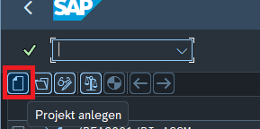
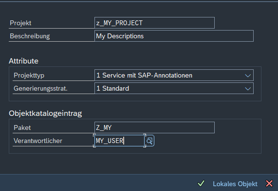
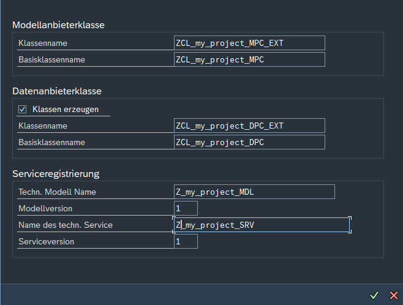

# Creating a service

## Steps

1. [Create a SEGW Project](#Create%20a%20SEGW%20Project)
2. [Generate classes](#Generate%20classes)
3. [Implement the framework MPC method](#Implement%20the%20framework%20MPC%20method)

## Create a SEGW Project

First of all we need to create a [SEGW](Definitions/SEGW.md) project. 
Transaction code: [SEGW](Definitions/SEGW.md)




## Generate classes 

To start with our development we first need the [SEGW](Definitions/SEGW.md) transaction to generate the [DPC](Definitions/DPC.md) and [MPC](Definitions/MPC.md) classes. 

You might want to change now the class names to match the system naming conventions.


After this we're done using the [SEGW](Definitions/SEGW.md) for developing reasons. 

## Implement the framework MPC method

First we open the "*MPC_EXT" Class. We then want to **redefine** the "define" method.
```abap
 PUBLIC SECTION.
    METHODS define REDEFINITION.
```

Next we add the OData framework by calling the "define_mpc" method of the framework class. Notice, that 'Z_MY_PROJECT' is the namespace, that we need to use in the framework view cluster.
```abap
METHOD define.
    TRY.
        NEW zcl_odata_fw_controller( 'Z_MY_PROJECT'
                    )->define_mpc(
                        i_model         = model
                        i_anno_model    = vocab_anno_model
                    ).
      CATCH zcx_odata INTO DATA(lo_error).
        zcl_odata_utils=>raise_mpc_error( lo_error ).
    ENDTRY.
  ENDMETHOD.
```
